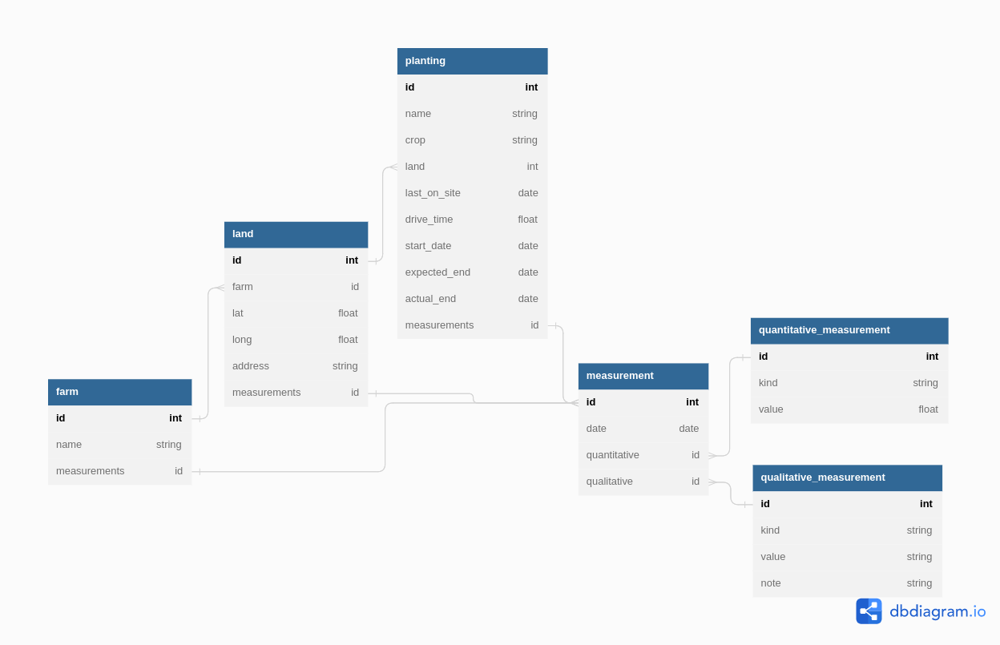

# Early Warning System
An auditing dashboard that reports when and where (in terms of relative urgency) an on-site farm visit or other action may be required. Through a combination of automated, manual and verbal survey submissions, the status of each farm can be updated with regular crop assessments and reports on general field health.

## Development Quick Start
First, make sure you have [Rust], [Node.js], and the full suite of [Tauri prerequisites] installed on your local development machine.

Then after cloning this repository, install the Node/JavaScript dependencies with [npm] (or the package manager of your choice), and start the Tauri development environment:

```sh
npm i               # Install JS dependencies
npm run tauri dev   # Start the Tauri development environment

# Alternatively, you can run the app in a browser-based dev env:
npm run dev
```

## Project Background
The Early Warning System (EWS) is part of a Runrig pilot project, which emerged from the [Skywoman MAIA interviews] with the [Richland Gro-Op] and [OSU Microfarm Project] from the fall of 2022. The EWS is one possible solution we identified to aid in the process of auditing crop production and ensure it is on track with the crop plan shared by all farms in the coop. To achieve profitability while aggregating yields from relatively small production lots, RGO takes orders in advance of planting and allows very little margin for error. Verifying each farm's status is therefore critical, but potentially quite time consuming. While on-site visits will always be necessary, the primary aim of this system is to provide the coop manager with reliable insights into where she can best focus her attention. View the rest of the [preliminary design doc] for further details, requirements and general context.

With this and future Runrig projects, we intend to provide the end users with carefully designed tools that can help bridge existing software platforms to meet their specific needs, while helping to improve the overall ecosystem of open technology. At the same time, we strive to make each Runrig apparatus more than just a proof-of-concept or a prototype, but a targeted intervention that delivers immediate gains for farmers and other food workers working in the field today.

For the Early Warning System, we're looking towards potential integrations with [SurveyStack], the [farmOS Data Model] (particularly [plans]), and L'Atelier Paysan's [Qrop].

In the process, we also seek to promote an open culture of design and knowledge production among practitioners from all levels and realms of expertise. Indeed, the process and relationships that come together in the production of these tools should be prioritized over the tools themselves, part of what we mean by ["ecology over architecture"].

To get involved or learn more about the Runrig community, you can [read the plan], sign up for our [newsletter] or checkout the schedule of Runrig [Open Design Workshops].

## Data Model
The data model consists of three tables representing physical items (farm, land, and planting) and three tables representing events or logs recorded by members (measurement, quantitative_measurement, and qualitative_measurement).



[Skywoman MAIA interviews]: https://github.com/skywoman/multifarm-aggregation-info-arch
[Richland Gro-Op]: https://richlandgro-op.com/
[OSU Microfarm Project]: https://osumarion.osu.edu/alumni-initiatives/initiatives/microfarm.html
[preliminary design doc]: https://github.com/runrig-coop/open-design-workshops/blob/c1f588d92bf1627dce6f5b80ab9eceacef0630a5/rgo-crop-plan-auditing/README.md
[SurveyStack]: https://surveystack.io
[farmOS Data Model]: https://farmos.org/model
[plans]: https://farmos.org/model/type/plan
[Qrop]: https://qrop.frama.io/
["ecology over architecture"]: https://runrig.org/overview.html#ecology-over-architecture
[read the plan]: https://runrig.org/overview.html
[newsletter]: https://buttondown.email/runrig
[Open Design Workshops]: https://github.com/runrig-coop/open-design-workshops
[Rust]: https://www.rust-lang.org/
[Node.js]: https://nodejs.org/
[Tauri prerequisites]: https://tauri.app/v1/guides/getting-started/prerequisites
[npm]: https://www.npmjs.com/
